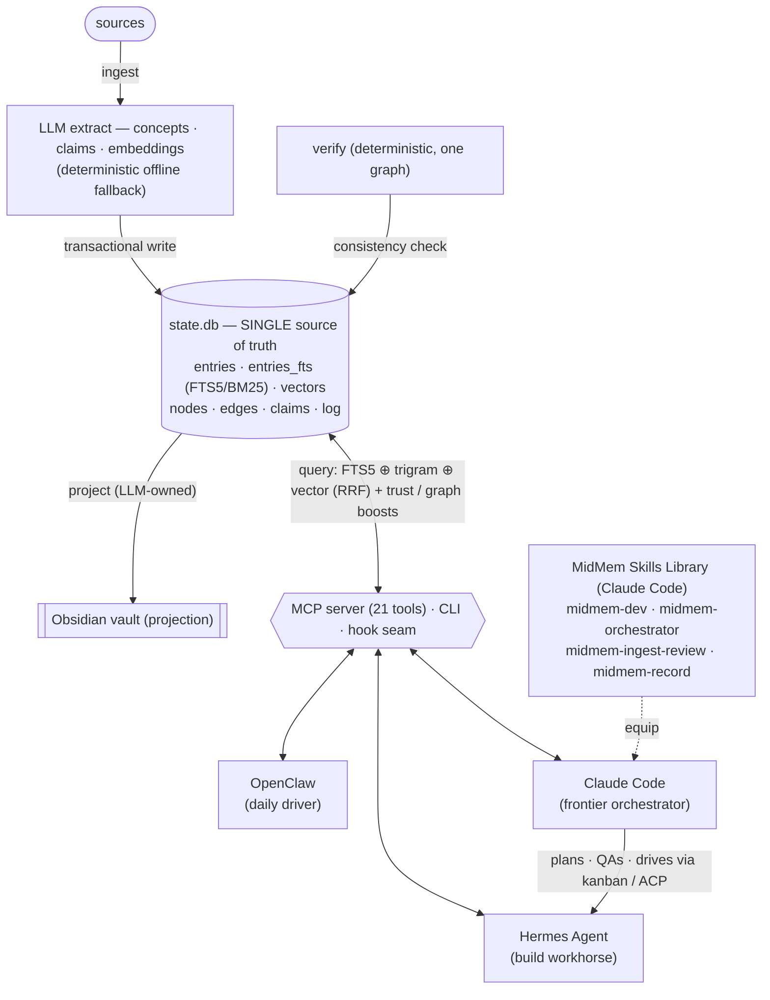

# midmem-kb-store — LLM Wiki Knowledge Router

A self-contained **LLM Wiki middleware layer**: a single source-of-truth knowledge store with
**hybrid retrieval (lexical + vector)**, tiered memory, a typed knowledge graph, claim
provenance, **fail-closed governance**, and an Obsidian projection — exposed to LLM agents over
the **Model Context Protocol (MCP)**, a CLI, and a programmatic API.

It is the broker between AI agents and their knowledge: agents `ingest`, `query`, and `remember`
through the router; the knowledge store sits *behind* it. Built for the OpenClaw + Hermes
dual-stack, but pure-core and modular — it runs in **4 modes** (standalone curation · OpenClaw
add-on · Hermes add-on · bridge) via exactly three surfaces: CLI, MCP, and the `bin/hook.mjs`
pre/post-turn seam. See [Integration](#integration) + `docs/INTEGRATION-MODES.md`.

> **Status (2026-07-02):** foundation + cross-agent scope + native→middleware bridge + retrieval
> upgrades (trust, trigram, token-budget, graph-boost, dim-guard) + selectable Qdrant vector backend +
> hand-off memory gate + self-driving lifecycle (decay / usage-earned promotion / auto-projection) +
> trigger-less `proactiveRecall` + DELEGATE-52 extraction grounding + **work-memory events with
> deterministic auto-ingest & categorization** (Brain adaptation) + **P4 temporal/workflow ranking
> boosts** + **P5 concept-node embeddings, communities & query routing** + **P6 claim supersede /
> contradiction / current()** + **P7 offline Brain-style benchmark** + **concept canonicalization
> (case/plural dedupe, curated `merge-concepts`, alias-aware retrieval)** + **vault projection
> pruning (stale pages removed; case-insensitive-share-safe slugs)** + **realpath ingest guard** +
> **log/audit/vector retention**. Tested: smoke **90/90** + bench green (`npm run verify`).
> Runnable Node ESM, **zero external dependencies** (Node ≥ 22.5 built-ins only: `node:sqlite`,
> `crypto`, `fetch`). `packages/core/` is the sole package — the active, self-contained foundation
> (the superseded interim scaffold was removed; it remains in git history if ever needed).

---

## Why

A single always-loaded memory file does not scale — it taxes every turn's context window. This
middleware decouples **capacity** from per-turn context: agents hold a tiny canonical index and
pull the relevant slice **on demand** via hybrid retrieval from an unbounded, shared store.

## Architecture



The three consumers share one `state.db` over the same MCP/CLI/hook surface. **Claude Code** is the
frontier-orchestration overlay: it drives Hermes (plan → dispatch build → QA) and records durably —
equipped by the **MidMem Skills Library** that ships in [`skills/`](skills/).

- **`state.db` is the source of truth**; the markdown vault is a deterministic projection of it.
- **Hybrid retrieval**: SQLite FTS5/BM25 (token lexical) ⊕ FTS5-trigram (substring lexical) ⊕ vector
  cosine (semantic), fused via Reciprocal Rank Fusion, plus trust + graph ref-chain boosts and an
  optional token budget. Vectors are incremental — lexical works standalone.
- **Vector backend is pluggable**: `sqlite` (in-DB JSON cosine, zero-dep, default) or `qdrant` (external ANN).
- **Tiers**: `fact` (raw, 7d TTL) → `memory` (synthesized, 30d) → `wisdom` (curated, ∞), with trust scoring.
- **Scope**: every entry is `openclaw` | `hermes` | `shared` — private working memory + a shared commons.
- **Hand-off gate ("firstware")**: pushes a memory brief into an agent hand-off so the receiver can't overlook it.

---

## Abstraction layers

The middleware is composed of swappable layers. **Required** layers must be present to function as
an LLM Wiki middleware; **recommended** layers add capability and are safe to defer.

| Layer | Module | Required? | Purpose | Swap / configure |
|---|---|---|---|---|
| **Integration / transport** | `bin/mcp-server.mjs` (MCP stdio) · `bin/cli.mjs` · `src/orchestrator.mjs` (API) | **Required** | The contract agents speak. MCP is primary; CLI + API are alternates. | register per stack (below) |
| **Store** | `src/db.mjs` (`state.db`) | **Required** | Single source of truth + unified index. | `MIDMEM_DB_PATH`; move to a shared path/NAS |
| **Retrieval** | `src/retrieval.mjs` | **Required** | Hybrid FTS5 ⊕ trigram ⊕ vector (RRF) + trust/graph boosts + token budget. | `fusionWeights`, `rrfK`, `trustWeight` |
| **Vector store** | `src/vectorstore.mjs` | **Required** | Pluggable ANN: `sqlite` (default) \| `qdrant`. Holds id→vector; `state.db` keeps metadata. | `MIDMEM_VECTOR_BACKEND`, `MIDMEM_QDRANT_URL` |
| **Embedding** | `src/embeddings.mjs` | **Required\*** | Vectors for the semantic lane + dimension guard. *Deterministic fallback if no model.* | `MIDMEM_EMBED_MODEL`, `MIDMEM_LLM_ENDPOINT` |
| **Governance** | `src/governance.mjs` | **Required** | Fail-closed policy gating on every mutation. | extend `defaultPolicies()` |
| **Tiered memory** | `src/memory.mjs` | Recommended | fact→memory→wisdom lifecycle (TTL, promote, archive). | `tiers` in config |
| **Extraction** | `src/extract.mjs` | Recommended | LLM concept/claim extraction. *Heuristic fallback.* | `MIDMEM_EXTRACT_MODEL` |
| **Graph** | `src/graph.mjs` | Recommended | Typed entities/edges; wikilinks; graph-context. | — |
| **Claims / provenance** | `src/claims.mjs` | Recommended | Synthadoc-style claim audit trail. | — |
| **Verification** | `src/verify.mjs` | Recommended | Deterministic contradiction/identity checks. | `sigmaStrictMode` |
| **Projection** | `src/project.mjs` | Recommended | Render `state.db` → Obsidian markdown. | `OBSIDIAN_VAULT_PATH`, `WIKI_PATH` |
| **Scope** | (in store/retrieval/governance) | Required *for dual*, else optional | Multi-agent private + shared partitioning. | `MIDMEM_AGENT_SCOPE` |
| **Bridge** | `src/bridge.mjs` (`midmem bridge`) | Recommended | Pull each stack's flat native memory into the store. | `bridgeSources` |
| **Trust / feedback** | (memory + retrieval) | Recommended | `trust_score` + usage/`feedback` loop; boosts ranking. | `trustWeight`, `feedback` tool |
| **Hand-off gate** | `src/handoff.mjs` (`handoff_brief`) | Recommended | Push a scoped memory brief into an agent hand-off (firstware). | profiles `local` / `frontier` |

\* The embedding layer is required for semantic recall, but the system **runs without a live model**
via a deterministic hash embedder (lexical retrieval still works). Load a real model before
production ingest so vectors are semantically meaningful.

---

## Integration

The middleware speaks MCP, so any MCP-capable agent can use it. Three supported topologies:

> **How knowledge is *captured* per stack** (OpenClaw · Hermes · Claude Code), what's reliable and what
> isn't, is in **[`docs/STACK-CAPTURE.md`](docs/STACK-CAPTURE.md)**. Packaged, reusable per-turn capture
> code + honest deployment status is in **[`integrations/`](integrations/)** (Hermes core capture is
> LIVE; the OpenClaw plugin is retired/reference). Engineering + grounding rules:
> **[`docs/DEVELOPMENT-GUIDELINES.md`](docs/DEVELOPMENT-GUIDELINES.md)**.

### Option A — OpenClaw only (1:1)
Register the MCP server in OpenClaw; it's the sole consumer. A single agent needs no scope
partitioning, so use `MIDMEM_AGENT_SCOPE=shared`.

```bash
openclaw mcp set middleware-memory '{
  "command": "node",
  "args": ["/path/to/midmem-kb-store/packages/core/bin/mcp-server.mjs"],
  "env": {
    "MIDMEM_DB_PATH": "/path/to/midmem-kb-store/state.db",
    "OBSIDIAN_VAULT_PATH": "/path/to/vault",
    "WIKI_PATH": "LLM Wiki",
    "MIDMEM_LLM_ENDPOINT": "http://localhost:1234/v1",
    "MIDMEM_EMBED_MODEL": "bge-m3",
    "MIDMEM_AGENT_SCOPE": "shared"
  }
}'
```

### Option B — Hermes only (1:1)
Register in `~/.hermes/config.yaml`; Hermes is the sole consumer. `MIDMEM_AGENT_SCOPE=shared`.

```yaml
mcp_servers:
  middleware-memory:
    command: node
    args:
      - /path/to/midmem-kb-store/packages/core/bin/mcp-server.mjs
    env:
      MIDMEM_DB_PATH: /path/to/midmem-kb-store/state.db
      OBSIDIAN_VAULT_PATH: /path/to/vault
      WIKI_PATH: LLM Wiki
      MIDMEM_LLM_ENDPOINT: http://localhost:1234/v1
      MIDMEM_EMBED_MODEL: bge-m3
      MIDMEM_AGENT_SCOPE: shared
```

### Option C — Dual integration (OpenClaw + Hermes, shared store)
Register in **both**, pointing at the **same `MIDMEM_DB_PATH`** — one shared knowledge store. Set a
**distinct `MIDMEM_AGENT_SCOPE` per stack** (`openclaw` / `hermes`) so each gets private working
memory plus the shared commons:

- OpenClaw registration: `MIDMEM_AGENT_SCOPE=openclaw`
- Hermes registration: `MIDMEM_AGENT_SCOPE=hermes`

Behavior: writes default to the caller's scope; reads return the caller's scope **+ `shared`**;
publish cross-agent knowledge with `scope: "shared"`. Governance blocks an agent from writing the
other's private scope. Concurrency across the two server processes is handled by SQLite WAL +
`busy_timeout`. (This is the current OpenDuck deployment.)

| | Option A | Option B | Option C |
|---|---|---|---|
| Consumers | OpenClaw | Hermes | both |
| `MIDMEM_AGENT_SCOPE` | `shared` | `shared` | `openclaw` / `hermes` |
| Private + shared memory | — | — | ✅ |
| Shared `state.db` | n/a | n/a | ✅ (same path) |

### Claude Code overlay — frontier orchestration, tight Hermes integration
Any of the options above can be **driven by Claude Code** as a third consumer of the same `state.db`.
Claude Code is not a fourth store mode — it reaches the core through the identical **CLI + MCP + hook**
surface — but it plays a distinct role: the **frontier orchestrator**. It plans MidMem work, dispatches
the mechanical build to **Hermes** (over kanban / ACP), QAs each result, and records durably — so
Claude Code and Hermes integrate tightly around one shared knowledge store: Claude Code decides and
verifies, Hermes builds, and both read/write the same tiered memory.

- **Register** the MCP server for Claude Code like any consumer (`MIDMEM_AGENT_SCOPE=shared`, or a
  dedicated scope in a multi-stack deployment), or just use the `midmem` **CLI** directly.
- **Equip it** with the [MidMem Skills Library](skills/) — `midmem-dev` (change the core),
  `midmem-orchestrator` + `midmem-ingest-review` (curate + QA), `midmem-record` (durable capture).
- **Guaranteed capture**: a Claude Code `Stop`-hook can block a turn from ending until a recordable
  change is written to MidMem — the most reliable capture path in the stack (see
  [`docs/STACK-CAPTURE.md`](docs/STACK-CAPTURE.md) and the `midmem-record` skill).

### Skills — which one to use per integration
Two skills front the store; pick by how you're driving the stack:

| Skill | Lives in | Drives | Use it for |
|---|---|---|---|
| **`midmem-ops`** | OpenClaw (`workspace/skills/`) | the OpenClaw agent | recall / store / ingest / proactive-recall / feedback directly via the MCP tools |
| **`hermes-build-orchestrator`** | Claude Code (`.claude/skills/`) | a frontier model (plan + QA); Hermes/qwen + gpt-5.5 build via kanban | multi-card builds with a QA gate per card |
| **`midmem-dev`** | **this repo** (`skills/`) | a frontier model (Claude Code) | changing the **core** code: add/adjust a capability with the test→verify→commit→record loop + guardrails |
| **`midmem-orchestrator`** | **this repo** (`skills/`) | same loop, MidMem-specialized | bulk knowledge curation: batch ingest, re-ground, dedup, vault verify |
| **`midmem-ingest-review`** | **this repo** (`skills/`) | a frontier model | ingest + audit knowledge quality and **cross-check OpenClaw vs Hermes understanding** (confabulation/drift/contradiction/scope) |
| **`midmem-record`** | **this repo** (`skills/`) | a frontier model (Claude Code) | durable capture: distilled lesson → wisdom tier + commit + the `Stop`-hook harness-guaranteed recording pattern |

- **OpenClaw only (Option A):** use **`midmem-ops`** — the OpenClaw agent operates memory itself
  (recall/store/ingest); no Hermes needed.
- **Hermes only / a build (Option B):** use **`hermes-build-orchestrator`** — it plans, dispatches
  kanban cards to Hermes, and QAs each; Hermes reads/writes the store through the same MCP tools.
- **OpenClaw + Hermes (Option C):** OpenClaw uses **`midmem-ops`** for its own recall and
  **`hermes-router`** to route research/builds to Hermes; at the ACP boundary prepend a
  **`handoff_brief`** so durable memory rides along (local models won't pull it on their own).
  Builds run through **`hermes-build-orchestrator`**. Both stacks share one `state.db`.

> Long-horizon integrity: `hermes-build-orchestrator` caps interactions/card, restrains tools, and
> QAs after every write (DELEGATE-52 mitigations); ingest applies a deterministic **grounding check**
> so confabulated extractions never persist. Supporting Claude Code ops skills: `openduck-doctor`
> (diagnostics/RCA), `openduck-record` (changelog+midmem+commit), `openduck-config`, `openduck-security-audit`.
> The **MidMem Skills Library** (`skills/`, shipped with this repo) holds `midmem-orchestrator` +
> `midmem-ingest-review` — symlink them into `~/.claude/skills/` (see `skills/README.md`).

---

## Quick start

```bash
# No install needed (Node ≥ 22.5 built-ins only).
cd packages/core
node test/smoke.mjs                          # end-to-end self-test (offline) → 90/90
npm run verify                               # smoke + Brain-style regression bench

node bin/cli.mjs init                        # show resolved config
node bin/cli.mjs ingest <file> --type note   # compile a source into the store (grounded)
node bin/cli.mjs query "..." --graph         # hybrid query (+ graph context, --maxTokens budget)
node bin/cli.mjs remember "..." --scope shared
node bin/cli.mjs brief                        # tier/claim/graph + vector-health counts
node bin/cli.mjs lint                         # audit: contradictions, orphans, dupe-concept
                                              #   candidates, low-trust wisdom
node bin/cli.mjs project                      # render the Obsidian vault (prunes stale pages)
node bin/cli.mjs bridge                       # pull native agent memory into the store
node bin/cli.mjs handoff "<task>" --profile local|frontier   # build a hand-off memory brief
node bin/cli.mjs work --kind task_attempt --task "..." ...   # record a work-memory event
node bin/cli.mjs tasks                        # ongoing requests (open task nodes)
node bin/cli.mjs claims "..."                 # current (freshest, non-superseded) claims
node bin/cli.mjs contradictions               # deterministic claim-contradiction candidates
node bin/cli.mjs merge-concepts "<from>" "<to>"   # curated near-duplicate concept merge
node bin/cli.mjs refresh-concepts             # rebuild concept embeddings + communities + dedupe
node bin/cli.mjs maintain --force             # full lifecycle pass (decay/promote/retention/project)
```

### MCP tools (21)
`ingest` · `query` · `remember` · `recall` · `brief` · `audit` · `forget` · `archive` ·
`promote` · `project` · `feedback` (trust) · `handoff_brief` (memory gate) · `maintain` ·
`proactive_recall` · `record_work` · `list_tasks` · `claims` · `claim_supersede` ·
`claim_contradictions` · `refresh_concepts` · `concept_merge`

**Hand-off memory gate ("firstware"):** `handoff_brief` builds a scoped, token-budgeted memory brief
to inject into an agent hand-off (e.g. before an ACP spawn, which doesn't share context) so the
receiving model can't overlook prior knowledge. Two profiles: **`local`** (small models — tight,
authoritative, push-only) and **`frontier`** (cloud models — richer, provenance + ids, push-brief +
pull-depth). The gate *calls* the store; it doesn't replace it (firstware-on-middleware).

### Configuration (env)
| Var | Default | Purpose |
|---|---|---|
| `MIDMEM_DB_PATH` | `<repo>/state.db` | Single source-of-truth DB |
| `OBSIDIAN_VAULT_PATH` | `~/Obsidian` | Vault root (projection target) |
| `WIKI_PATH` | `LLM Wiki` | Wiki subfolder in the vault |
| `MIDMEM_LLM_ENDPOINT` | `http://localhost:1234/v1` | OpenAI-compatible endpoint (embed + extract) |
| `MIDMEM_EMBED_MODEL` | `bge-m3` | Embedding model (load it in your server) |
| `MIDMEM_VECTOR_BACKEND` | `sqlite` | Vector store: `sqlite` (in-DB, zero-dep) or `qdrant` |
| `MIDMEM_QDRANT_URL` | `http://localhost:6333` | Qdrant endpoint (when backend=qdrant) |
| `MIDMEM_EXTRACT_MODEL` | (chat model) | Extraction model |
| `MIDMEM_AGENT_SCOPE` | `shared` | This consumer's scope: `openclaw`/`hermes`/`shared` |
| `MIDMEM_LLM_ENABLED` | `1` | Set `0` to force offline/deterministic fallbacks |
| `MIDMEM_SOURCE_ROOTS` | repo/workspace/vault dirs | Allowed ingest roots (realpath'd path-traversal guard) |
| `MIDMEM_GROUNDING_MIN_OVERLAP` | `0.5` | DELEGATE-52 grounding threshold (quarantine below) |
| `MIDMEM_AUTO_INGEST` | `1` | maintain() auto-bridges agent work/session dirs |
| `MIDMEM_MAINTENANCE` | `1` | Self-driving lifecycle (decay/promotion/projection) |
| `MIDMEM_RETENTION_DAYS` | `90` | Forced maintain prunes log/audit rows + orphan vectors older than this (0 = off) |
| `MIDMEM_WORK_MEMORY` | `1` | Work-memory events (`record_work`, task tracking) |
| `MIDMEM_CONCEPT_ROUTING` | `1` | P5 concept-node routing + canonical dedupe in forced maintain |

---

## Recommended embedding model
`BAAI/bge-m3` (1024-dim, 8192-ctx, hybrid dense+sparse) — best fit for hybrid wiki RAG and Qdrant.
Lighter alternative: `nomic-embed-text-v1.5` (768-dim). Pick one **before first ingest** and keep
it across any vector-store migration (no re-embedding; the dimension guard enforces consistency).

## Roadmap
- ✅ ~~Vault → NAS share~~ — done 2026-06-29 (`OBSIDIAN_VAULT_PATH=/mnt/OpenDuck-Vault`; projection
  uses canonical lowercase slugs + stale-page pruning, so the case-insensitive CIFS share is safe).
- ✅ ~~Decay scanner + near-dup report~~ — done: lifecycle decay is self-driving; `lint` reports
  `dupeConcepts` candidates (curated `merge-concepts` applies them) + `lowTrustWisdom`.
- Vector store → **Qdrant** (decided over ChromaDB; `MIDMEM_VECTOR_BACKEND=qdrant`, adapter built —
  live path pending a running instance on the NAS; end-state pairs with a vLLM operator on Proxmox).
- **Research-wave promotion + topic tags** (2026-07-01 review): deterministic trigger (N
  same-community ingests within M days) surfaces a wave in `brief`; synthesis stays curated.
- **Fine-tuned-LLM `wisdom` tier** trained from curated wisdom (weight-space long-term memory).
- Pre-LLM-call memory gate (per-turn brief, sibling to the hand-off gate); TypeScript migration;
  bidirectional vault sync. Scale note: per-query concept scans are fine at ~250 entries; index
  concepts into a table around ~50K.

## Repository layout
```
packages/core/         # ← active foundation (this README describes it)
  src/                 # db, memory, retrieval, vectorstore, embeddings, extract, graph, claims,
                       # verify, governance, project, bridge, handoff, workmemory, concepts,
                       # orchestrator, config
  bin/                 # cli.mjs, mcp-server.mjs, hook.mjs (pre/post-turn seam — the 4-modes caller)
  test/                # smoke.mjs (90 checks) + bench.mjs (Brain-style regression gate)
wiki/ memory/ graph/ claims/ audit/ config/   # scaffold-era dirs (vault is now external)
skills/                # MidMem Skills Library (Claude Code) — see skills/README.md
integrations/          # packaged reusable per-turn capture code + status — see integrations/README.md
docs/                  # design notes — INTEGRATION-MODES, STACK-CAPTURE, DEVELOPMENT-GUIDELINES
RESEARCH.md            # research → architecture-decision record (DELEGATE-52, …)
```

## Subfolder guides
- [`packages/core/README.md`](packages/core/README.md) — the engine: modules, how to run, env vars.
- [`skills/README.md`](skills/README.md) — the MidMem Skills Library (`midmem-dev`,
  `midmem-orchestrator`, `midmem-ingest-review`, `midmem-record`) + install.
- [`docs/README.md`](docs/README.md) — design notes index.
- [`RESEARCH.md`](RESEARCH.md) — why the store is built the way it is, grounded in papers.

## License
[Apache License 2.0](LICENSE)
